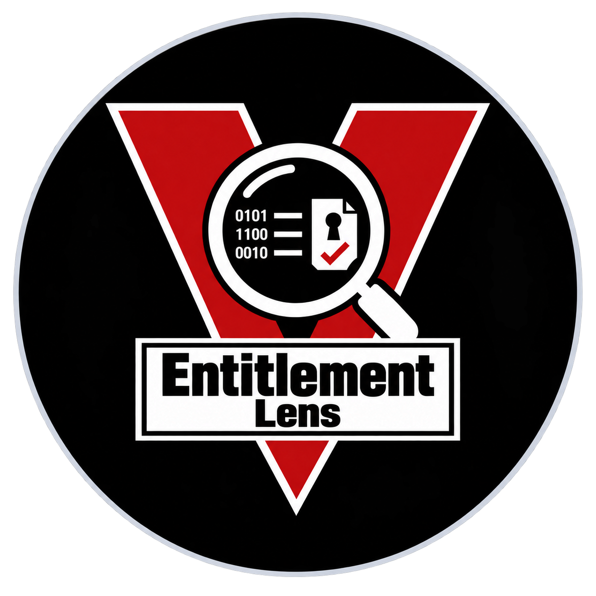
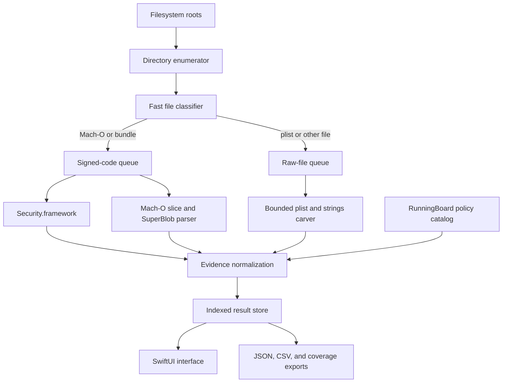

<p align="center">
  
</p>

# EntitlementLens

### A native macOS workbench for inspecting signed entitlements, Mach-O code signatures, embedded evidence, and build-scoped RunningBoard policy

> **Scope:** EntitlementLens performs static inspection of files you are authorized to examine. It does not bypass TCC, System Integrity Protection, AMFI, sandbox policy, code signing, or service-side authorization. A declared entitlement or installed policy establishes capability or configuration—not runtime use, successful authorization, or compromise.

EntitlementLens is a SwiftUI application for examining Mach-O binaries, application bundles, frameworks, property lists, and other files. It combines Security.framework signing information with per-architecture Mach-O inspection, bounded code-signature parsing, optional raw evidence carving, artifact provenance, installed-counterpart comparison, and explicit scan-coverage reporting.

The interface is designed for security research, software provenance review, incident response, and macOS platform study. Every result keeps signed declarations separate from supporting strings, build-scoped policy, signature integrity, execution policy, and runtime authorization.

## Contents

- [Start here](#start-here)
- [Visual tour](#visual-tour)
- [What EntitlementLens covers](#what-entitlementlens-covers)
- [How the pipeline fits together](#how-the-pipeline-fits-together)
- [Requirements](#requirements)
- [Installation and launch](#installation-and-launch)
- [Scanning workflow](#scanning-workflow)
- [Entitlement and signature inspection](#entitlement-and-signature-inspection)
- [Deep carving and supporting evidence](#deep-carving-and-supporting-evidence)
- [RunningBoard policy decoding](#runningboard-policy-decoding)
- [Coverage, permissions, and privileged retry](#coverage-permissions-and-privileged-retry)
- [Search, actions, and exports](#search-actions-and-exports)
- [Interpretation boundaries](#interpretation-boundaries)
- [Development and testing](#development-and-testing)
- [Troubleshooting](#troubleshooting)
- [Project status and license](#project-status-and-license)

## Start here

Clone the repository, build the application bundle, sign it ad hoc for local development, and open it:

```bash
git clone https://github.com/hideouts-io/EntitlementLens.git
cd EntitlementLens
./script/build_and_run.sh
```

Choose **Scan Folder…** for a focused inspection, or use the Applications, System, and Entire Mac quick scans. Start with **Deep carve** disabled when you need fast signed-code inventory. Enable it when bounded embedded plist and strings-like evidence is relevant to the investigation.

Use the Coverage view after every significant scan. A missing result is not evidence that a file or entitlement is absent if the corresponding path was excluded, inaccessible, skipped, cancelled, or not analyzed by the selected options.

## Visual tour

Focused scan and navigation | Per-architecture entitlements and SuperBlob slots
--- | ---
 | 

The screenshots use temporary copies of the Apple-supplied `/usr/bin/codesign` and `/usr/bin/ssh` binaries in `/tmp/EntitlementLens-Demo`. They contain no user documents, account identifiers, credentials, or private forensic evidence.

## What EntitlementLens covers

| Area | What it collects | Important boundary |
| --- | --- | --- |
| Code signatures | Signature status, signed-resource validation, identifier, team, authorities, requirements, flags, timestamps, CDHashes, and the main executable | An intact signature establishes integrity relative to that signature; it does not establish that the software is benign |
| Declared entitlements | Security.framework entitlement dictionaries and typed values | Declarations do not prove that AMFI, TCC, SIP, the sandbox, or a service granted the capability at runtime |
| Per-architecture evidence | Mach-O slices, UUIDs, deployment targets, SDK versions, code-signature ranges, architecture-specific dictionaries, and CDHashes | Universal binaries can carry architecture-specific evidence; one flattened dictionary is not sufficient |
| SuperBlob slots | Bounded XML and DER entitlement slots with offsets, sizes, hashes, decoder source, and warnings | DER blobs are retained as structural/hash evidence; decoded dictionaries come from Security.framework where available |
| Embedded evidence | Bounded XML/binary property lists and keyword-oriented printable strings | Carved keys and strings are supporting evidence, not signed entitlements |
| Artifact provenance | SHA-256, size, ownership, mode, inode/device, timestamps, filesystem flags, volume metadata, quarantine value, source OS, and Mach-O build metadata | Metadata describes the collected artifact and host view; it does not prove execution |
| Installed counterpart | Comparison between an extracted system path and the installed path, including hashes, signing data, architectures, and entitlement keys | A match or difference is scoped to the compared files and collection time |
| RunningBoard policy | Raw values, build-scoped labels, decoder source, confidence, OS build, policy references, and policy hashes | Installed policy describes what RunningBoard can apply, not what a process requested or received |
| Scan coverage | Discovered, analyzed, skipped, permission-limited, cancelled, and failed items with recovery guidance | Coverage failures remain first-class results instead of disappearing silently |

## How the pipeline fits together



The enumerator does not follow symbolic links and deduplicates files by device and inode. A bounded producer/consumer channel applies backpressure, while worker count adapts to the host. Raw reads are chunked, string extraction stops at configured limits, and the result store precomputes search text and filter counts for large scans.

## Requirements

- macOS 14 or later;
- Swift 6.2-compatible Xcode or Command Line Tools;
- permission to inspect the selected files;
- Full Disk Access only when the intended scope includes TCC-protected locations;
- an Apple Development or Developer ID identity only if you want to register the optional privileged helper.

EntitlementLens uses native macOS frameworks and Swift Package Manager. It has no third-party runtime package dependencies.

## Installation and launch

### Build and open the app

```bash
./script/build_and_run.sh
```

The launcher builds both executables, creates `dist/EntitlementLens.app`, generates the multi-resolution application icon, writes the bundle metadata, signs the helper and app, verifies the complete signature, and opens the application.

The default build uses an ad hoc signature. That is suitable for local development, but it has no Developer ID identity and is not notarized.

### Launch and diagnostic modes

```bash
./script/build_and_run.sh --verify
./script/build_and_run.sh --debug
./script/build_and_run.sh --logs
./script/build_and_run.sh --telemetry
```

`--verify` launches the app and confirms that its process remains active. The logging modes stream either process messages or the `io.hideouts.EntitlementLens` logging subsystem.

### Team-signed build

The privileged helper is intentionally unavailable in ad hoc builds. To produce a local team-signed build, provide an identity already available in your keychain:

```bash
ENTITLEMENTLENS_CODESIGN_IDENTITY="Apple Development: Your Name (TEAMID)" \
  ./script/build_and_run.sh
```

The app and helper must share the same signing team. Registration still requires the macOS-owned approval flow in Login Items. Do not weaken system security settings to make the helper run.

## Scanning workflow

1. Select a focused folder or quick-scan scope.
2. Decide whether hidden files belong in scope.
3. Leave **Deep carve** off for a faster signing inventory, or enable it for bounded embedded-object and strings analysis.
4. Review the default exclusions before a whole-machine scan and add semicolon-separated absolute paths when necessary.
5. Start the scan and watch discovered, analyzed, and issue counts independently.
6. Filter by signed entitlements, private entitlements, unsigned code, invalid signatures, embedded evidence, RunningBoard policy, or coverage outcome.
7. Inspect the detail pane before exporting or drawing conclusions.
8. Export findings and coverage separately so collection limits remain visible beside the evidence.

Quick scopes include:

- **Applications:** `/Applications` and `/System/Applications`;
- **System:** CoreServices, public and private frameworks, and common executable directories;
- **Entire Mac:** application, system, library, private, and user roots with configurable exclusions.

Whole-machine scans can be expensive and may encounter TCC-protected, transient, or synthetic filesystem locations. A smaller, hypothesis-driven scope is easier to validate and reproduce.

## Entitlement and signature inspection

EntitlementLens requests signing information through Security.framework, including `kSecCodeInfoEntitlementsDict`. For a universal binary, it constructs architecture-specific static-code views with `kSecCodeAttributeArchitecture` instead of assuming that every slice has identical declarations.

The Mach-O parser independently records each slice and bounds its `LC_CODE_SIGNATURE` region. The code-signature parser then recognizes:

- XML entitlement slot type `5` with magic `0xFADE7171`;
- DER entitlement slot type `7` with magic `0xFADE7172`.

Each retained slot includes its architecture, file offset, byte count, SHA-256 digest, decoder source, decoded entries when available, and structural warning state. The classifier validates a plausible universal Mach-O structure before treating `0xCAFEBABE` as a fat binary, avoiding confusion with Java class files.

The detail view reports signature integrity, signed-resource integrity, execution-policy observation, entitlement scope, and runtime authorization as separate fields. Runtime authorization remains **Not assessed** because static inspection cannot establish a service decision that only exists during execution.

## Deep carving and supporting evidence

When **Deep carve** is enabled, EntitlementLens performs bounded raw analysis:

- XML property-list candidates are located and parsed within explicit limits;
- binary property lists are structurally bounded using their trailer and object table rather than read to end-of-file;
- printable strings are scanned incrementally and stop at the configured match limit;
- truncation, malformed structures, read failures, and skipped analysis become coverage warnings.

The UI deliberately labels these results as embedded or supporting evidence. A string such as `com.apple.private.example` inside a binary may be documentation, a denylist, dead code, test data, or a referenced capability. It must not be promoted to a signed entitlement without code-signature evidence.

## RunningBoard policy decoding

EntitlementLens includes a build-scoped decoder derived from the current installed LifecyclePolicy and RunningBoard research catalog. A decoded record retains:

- the raw field and value;
- a typed numeric family where known;
- the decoded or cross-referenced label;
- the decoding source;
- confidence and OS build;
- the current domain/policy reference and policy hash.

For example, the catalog cross-references `RunningReason = 20212` with `com.apple.coreos/reconnect` on the researched build. This is not presented as a stable public Apple enum.

The detailed catalog and its limits are documented in [RunningBoard-Private-Value-Catalog.md](Research/RunningBoard-Private-Value-Catalog.md). The occurrence-level inventories are retained in:

- [RunningBoard-RunningReason-Catalog.csv](Research/RunningBoard-RunningReason-Catalog.csv)
- [RunningBoard-Installed-Policy-Inventory.csv](Research/RunningBoard-Installed-Policy-Inventory.csv)

## Coverage, permissions, and privileged retry

EntitlementLens distinguishes several access boundaries:

- **POSIX permissions:** a narrowly scoped privileged helper may be able to retry eligible metadata or signing inspection;
- **TCC / Full Disk Access:** root alone does not bypass this privacy decision;
- **System Integrity Protection:** neither Full Disk Access nor the helper disables SIP;
- **missing or changing files:** filesystem races are reported separately from authorization failures;
- **scan configuration:** exclusions and disabled Deep carve are reported as intentional non-coverage.

The helper accepts a bounded list of explicit paths, validates its client, and returns structured inspection records. It is not a general-purpose root shell and is disabled when the app has only an ad hoc signature.

Open the skipped/issues view to see the category, path, error, recovery suggestion, and whether a privileged retry is eligible. Export **Coverage JSON…** when results need to be reviewed or shared.

## Search, actions, and exports

The result index supports fast search across names, paths, signing identities, entitlement keys and values, embedded evidence, provenance, and RunningBoard records. Large entitlement collections and long values use paged presentation while preserving complete values for copying and export.

Right-click a result to:

- reveal it in Finder;
- open an eligible file in TextEdit;
- copy its path;
- copy all collected data for that result.

Exports include:

- complete findings as JSON;
- a flattened CSV summary;
- skipped, failed, excluded, and permission-limited coverage as JSON.

Export is written atomically so a failed replacement does not destroy an existing destination file.

## Interpretation boundaries

Keep these statements separate in reports:

| Evidence | Supported conclusion | Unsupported conclusion |
| --- | --- | --- |
| Signed entitlement dictionary | The signature declares the recorded key/value | The process exercised or was granted the capability |
| Intact code signature | The checked code/resources satisfy the recorded signature | The software is safe, Apple-authored, or authorized to run in every context |
| Embedded entitlement-like string | The bytes contain that string at the recorded offset | The string is an active or signed entitlement |
| Installed RunningBoard policy | The current build contains that policy/configuration | A process requested, received, or used the policy |
| Full Disk Access | The app may read additional TCC-protected data after user approval | SIP, sandbox, or service authorization is bypassed |
| Privileged helper result | The helper inspected the explicit eligible path with elevated POSIX access | Every protected path is readable or every operation is authorized |
| No finding | No matching evidence was collected within the recorded scope | The artifact or capability is absent from the machine |

Preserve the raw export, coverage export, application version, macOS build, scan roots, options, exclusions, and collection time when a result may need to be reproduced.

## Development and testing

Build and run the full test suite:

```bash
swift build
swift test
```

The current suite contains 21 Swift Testing integration tests across four suites. It exercises system-binary signing inspection, architecture and provenance collection, complete scan flow, bounded queue cancellation and draining, embedded-object boundary handling, large-result search/export behavior, atomic export failure handling, and access-issue classification.

Project layout:

```text
Assets/                              Logo source used for app packaging
Research/                            Build-scoped RunningBoard catalogs
Sources/EntitlementLens/             SwiftUI app, models, stores, and services
Sources/EntitlementLensPrivilegedHelper/
                                     Narrow privileged inspection service
Sources/PrivilegedProtocol/          Shared XPC request/response types
Tests/EntitlementLensTests/          Integration and cancellation tests
script/build_and_run.sh              Build, package, sign, verify, and launch
```

## Troubleshooting

### The scan reports access issues

Open the coverage view and use its category-specific guidance. Grant Full Disk Access only when protected data is intentionally in scope. A `sudo` launch or privileged helper cannot substitute for TCC approval and does not bypass SIP.

### The privileged helper is disabled

Ad hoc signatures have no signing team, so EntitlementLens refuses to register the helper. Build the app and helper with the same Apple Development or Developer ID identity, then use the macOS Login Items approval flow.

### The app is blocked at first launch

Local builds are ad hoc-signed unless a signing identity is supplied. Verify the source and build locally. Do not disable Gatekeeper globally or alter System Integrity Protection.

### A binary shows no entitlements

Check the scan coverage, signature status, per-architecture section, and entitlement-slot warnings. Some signed code legitimately has no entitlement dictionary. Absence should only be reported after the relevant architecture and signature region were successfully assessed.

### A whole-machine scan is slow

Use focused roots, keep Deep carve disabled initially, and exclude volumes or directories outside the investigation. Whole-machine scans are bounded, but the number and size of files still determine total work.

## Project status and license

EntitlementLens is an early-stage macOS research and inspection tool. Its private-framework and LifecyclePolicy interpretations are build-scoped and can change between macOS releases.

EntitlementLens is released under the [MIT License](LICENSE).

Issues and focused pull requests are welcome. Reports should include the macOS version/build, target type, minimal reproduction steps, expected result, actual result, and sanitized coverage output. Never attach credentials, private keys, proprietary binaries, personal data, or unrestricted forensic evidence to a public issue.
