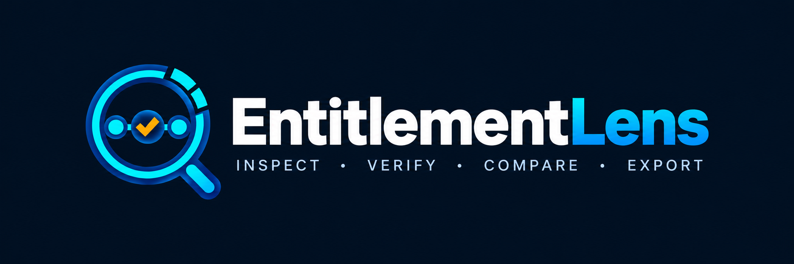
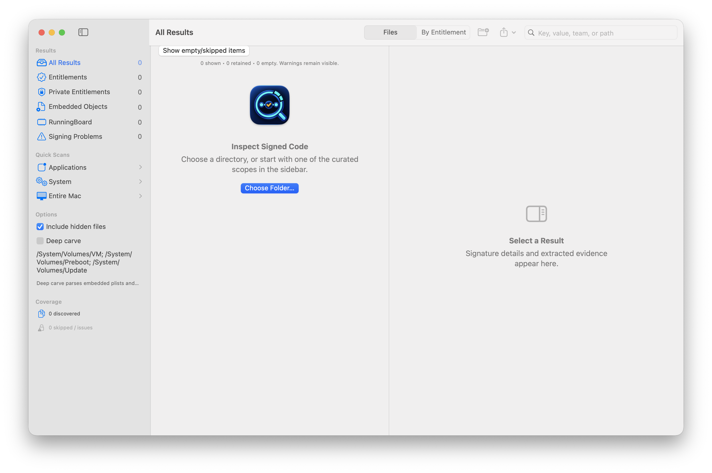
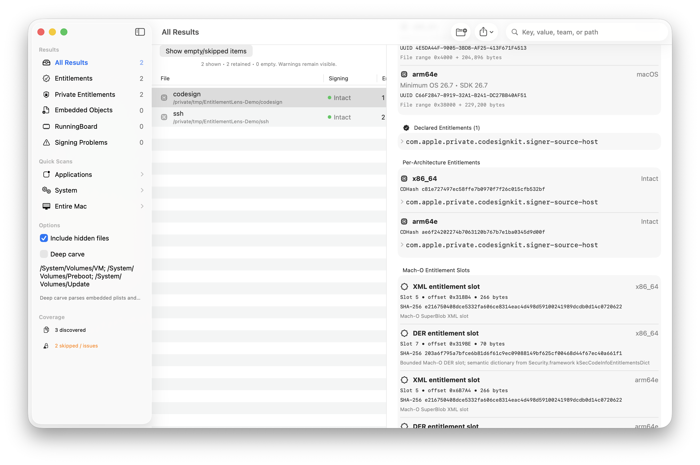
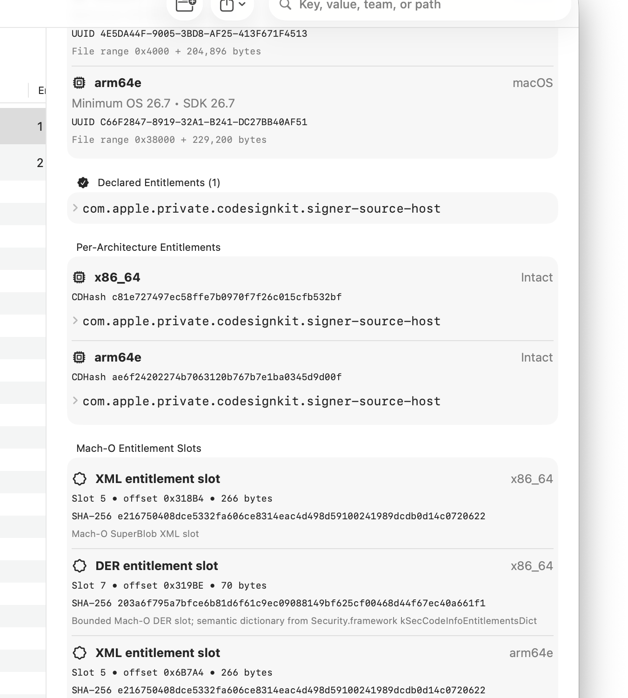
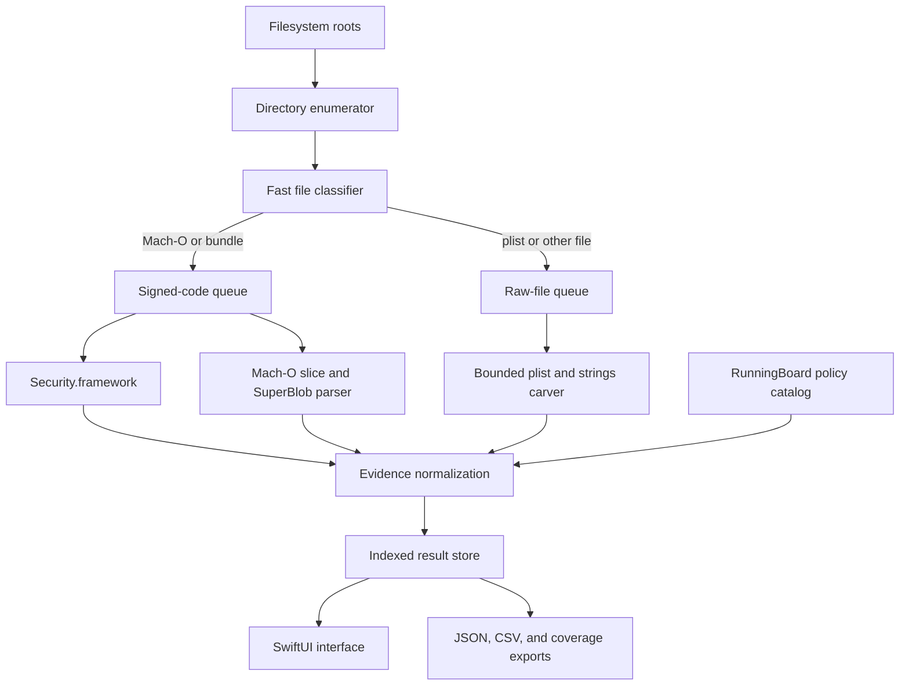

<p align="center">
  
</p>

# EntitlementLens

### A native macOS workbench for inspecting signed entitlements, Mach-O code signatures, embedded evidence, and build-scoped RunningBoard policy

> **Scope:** EntitlementLens performs static inspection of files you are authorized to examine. It does not bypass TCC, System Integrity Protection, AMFI, sandbox policy, code signing, or service-side authorization. A declared entitlement or installed policy establishes capability or configuration—not runtime use, successful authorization, or compromise.

EntitlementLens is a SwiftUI application for examining Mach-O binaries, application bundles, frameworks, property lists, and other files. It combines Security.framework signing information with per-architecture Mach-O inspection, bounded code-signature parsing, optional raw evidence carving, artifact provenance, installed-counterpart comparison, and explicit scan-coverage reporting.

The interface is designed for security research, software provenance review, incident response, and macOS platform study. Every result keeps signed declarations separate from supporting strings, build-scoped policy, signature integrity, execution policy, and runtime authorization.

## Contents

- [Start here](#start-here)
- [Visual tour](#visual-tour)
- [What EntitlementLens covers](#what-entitlementlens-covers)
- [How the pipeline fits together](#how-the-pipeline-fits-together)
- [Requirements](#requirements)
- [Installation and launch](#installation-and-launch)
- [Scanning workflow](#scanning-workflow)
- [Entitlement and signature inspection](#entitlement-and-signature-inspection)
- [Deep carving and supporting evidence](#deep-carving-and-supporting-evidence)
- [RunningBoard policy decoding](#runningboard-policy-decoding)
- [Coverage, permissions, and privileged retry](#coverage-permissions-and-privileged-retry)
- [Search, actions, and exports](#search-actions-and-exports)
- [Interpretation boundaries](#interpretation-boundaries)
- [Development and testing](#development-and-testing)
- [Troubleshooting](#troubleshooting)
- [Project status and license](#project-status-and-license)

## Start here

Clone the repository, build the application bundle, sign it ad hoc for local development, and open it:

```bash
git clone https://github.com/hideouts-io/EntitlementLens.git
cd EntitlementLens
./script/build_and_run.sh
```

Choose **Scan Folder…** for a focused inspection, or use the Applications, System, and Entire Mac quick scans. Start with **Deep carve** disabled when you need fast signed-code inventory. Enable it when bounded embedded plist and strings-like evidence is relevant to the investigation.

Use the Coverage view after every significant scan. A missing result is not evidence that a file or entitlement is absent if the corresponding path was excluded, inaccessible, skipped, cancelled, or not analyzed by the selected options.

## Visual tour



Focused scan and navigation | Per-architecture entitlements and SuperBlob slots
--- | ---
 | 

The focused scan screenshots use temporary copies of the Apple-supplied `/usr/bin/codesign` and `/usr/bin/ssh` binaries in `/tmp/EntitlementLens-Demo`. They contain no user documents, account identifiers, credentials, or private forensic evidence.

## What EntitlementLens covers

| Area | What it collects | Important boundary |
| --- | --- | --- |
| Code signatures | Signature status, signed-resource validation, identifier, team, authorities, requirements, flags, timestamps, CDHashes, and the main executable | An intact signature establishes integrity relative to that signature; it does not establish that the software is benign |
| Declared entitlements | Security.framework entitlement dictionaries and typed values | Declarations do not prove that AMFI, TCC, SIP, the sandbox, or a service granted the capability at runtime |
| Per-architecture evidence | Mach-O slices, UUIDs, deployment targets, SDK versions, code-signature ranges, architecture-specific dictionaries, and CDHashes | Universal binaries can carry architecture-specific evidence; one flattened dictionary is not sufficient |
| SuperBlob slots | Bounded XML and DER entitlement slots with offsets, sizes, hashes, decoder source, and warnings | DER blobs are retained as structural/hash evidence; decoded dictionaries come from Security.framework where available |
| Embedded evidence | Bounded XML/binary property lists and keyword-oriented printable strings | Carved keys and strings are supporting evidence, not signed entitlements |
| Artifact provenance | SHA-256, size, ownership, mode, inode/device, timestamps, filesystem flags, volume metadata, quarantine value, source OS, and Mach-O build metadata | Metadata describes the collected artifact and host view; it does not prove execution |
| Installed counterpart | Comparison between an extracted system path and the installed path, including hashes, signing data, architectures, and entitlement keys | A match or difference is scoped to the compared files and collection time |
| RunningBoard policy | Raw values, build-scoped labels, decoder source, confidence, OS build, policy references, and policy hashes | Installed policy describes what RunningBoard can apply, not what a process requested or received |
| Scan coverage | Discovered, analyzed, skipped, permission-limited, cancelled, and failed items with recovery guidance | Coverage failures remain first-class results instead of disappearing silently |

## How the pipeline fits together



The enumerator does not follow symbolic links and deduplicates files by device and inode. A bounded producer/consumer channel applies backpressure, while worker count adapts to the host. Raw reads are chunked, string extraction stops at configured limits, and the result store precomputes search text and filter counts for large scans.

## Requirements

- macOS 14 or later;
- Swift 6.2-compatible Xcode or Command Line Tools;
- permission to inspect the selected files;
- Full Disk Access only when the intended scope includes TCC-protected locations;
- an Apple Development or Developer ID identity only if you want to register the optional privileged helper.

EntitlementLens uses native macOS frameworks and Swift Package Manager. It has no third-party runtime package dependencies.

## Installation and launch

### Build and open the app

```bash
./script/build_and_run.sh
```

The launcher builds both executables, creates `dist/EntitlementLens.app`, generates the multi-resolution application icon, writes the bundle metadata, signs the helper and app, verifies the complete signature, and opens the application.

The default build uses an ad hoc signature. That is suitable for local development, but it has no Developer ID identity and is not notarized.

### Launch and diagnostic modes

```bash
./script/build_and_run.sh --verify
./script/build_and_run.sh --debug
./script/build_and_run.sh --logs
./script/build_and_run.sh --telemetry
```

`--verify` launches the app and confirms that its process remains active. The logging modes stream either process messages or the `io.hideouts.EntitlementLens` logging subsystem.

### Team-signed build

The privileged helper is intentionally unavailable in ad hoc builds. To produce a local team-signed build, provide an identity already available in your keychain:

```bash
ENTITLEMENTLENS_CODESIGN_IDENTITY="Apple Development: Your Name (TEAMID)" \
  ./script/build_and_run.sh
```

The app and helper must share the same signing team. Registration still requires the macOS-owned approval flow in Login Items. Do not weaken system security settings to make the helper run.

## Scanning workflow

1. Select a focused folder or quick-scan scope.
2. Decide whether hidden files belong in scope.
3. Leave **Deep carve** off for a faster signing inventory, or enable it for bounded embedded-object and strings analysis.
4. Review the default exclusions before a whole-machine scan and add semicolon-separated absolute paths when necessary.
5. Start the scan and watch discovered, analyzed, and issue counts independently.
6. Filter by signed entitlements, private entitlements, unsigned code, invalid signatures, embedded evidence, RunningBoard policy, or coverage outcome.
7. Inspect the detail pane before exporting or drawing conclusions.
8. Export findings and coverage separately so collection limits remain visible beside the evidence.

Quick scopes include:

- **Applications:** `/Applications` and `/System/Applications`;
- **System:** CoreServices, public and private frameworks, and common executable directories;
- **Entire Mac:** application, system, library, private, and user roots with configurable exclusions.

Whole-machine scans can be expensive and may encounter TCC-protected, transient, or synthetic filesystem locations. A smaller, hypothesis-driven scope is easier to validate and reproduce.

## Entitlement and signature inspection

EntitlementLens requests signing information through Security.framework, including `kSecCodeInfoEntitlementsDict`. For a universal binary, it constructs architecture-specific static-code views with `kSecCodeAttributeArchitecture` instead of assuming that every slice has identical declarations.

The Mach-O parser independently records each slice and bounds its `LC_CODE_SIGNATURE` region. The code-signature parser then recognizes:

- XML entitlement slot type `5` with magic `0xFADE7171`;
- DER entitlement slot type `7` with magic `0xFADE7172`.

Each retained slot includes its architecture, file offset, byte count, SHA-256 digest, decoder source, decoded entries when available, and structural warning state. The classifier validates a plausible universal Mach-O structure before treating `0xCAFEBABE` as a fat binary, avoiding confusion with Java class files.

The detail view reports signature integrity, signed-resource integrity, execution-policy observation, entitlement scope, and runtime authorization as separate fields. Runtime authorization remains **Not assessed** because static inspection cannot establish a service decision that only exists during execution.

## Deep carving and supporting evidence

When **Deep carve** is enabled, EntitlementLens performs bounded raw analysis:

- XML property-list candidates are located and parsed within explicit limits;
- binary property lists are structurally bounded using their trailer and object table rather than read to end-of-file;
- printable strings are scanned incrementally and stop at the configured match limit;
- truncation, malformed structures, read failures, and skipped analysis become coverage warnings.

The UI deliberately labels these results as embedded or supporting evidence. A string such as `com.apple.private.example` inside a binary may be documentation, a denylist, dead code, test data, or a referenced capability. It must not be promoted to a signed entitlement without code-signature evidence.

## RunningBoard policy decoding

EntitlementLens includes a build-scoped decoder derived from the current installed LifecyclePolicy and RunningBoard research catalog. A decoded record retains:

- the raw field and value;
- a typed numeric family where known;
- the decoded or cross-referenced label;
- the decoding source;
- confidence and OS build;
- the current domain/policy reference and policy hash.

For example, the catalog cross-references `RunningReason = 20212` with `com.apple.coreos/reconnect` on the researched build. This is not presented as a stable public Apple enum.

The detailed catalog and its limits are documented in [RunningBoard-Private-Value-Catalog.md](Research/RunningBoard-Private-Value-Catalog.md). The occurrence-level inventories are retained in:

- [RunningBoard-RunningReason-Catalog.csv](Research/RunningBoard-RunningReason-Catalog.csv)
- [RunningBoard-Installed-Policy-Inventory.csv](Research/RunningBoard-Installed-Policy-Inventory.csv)

## Coverage, permissions, and privileged retry

EntitlementLens distinguishes several access boundaries:

- **POSIX permissions:** a narrowly scoped privileged helper may be able to retry eligible metadata or signing inspection;
- **TCC / Full Disk Access:** root alone does not bypass this privacy decision;
- **System Integrity Protection:** neither Full Disk Access nor the helper disables SIP;
- **missing or changing files:** filesystem races are reported separately from authorization failures;
- **scan configuration:** exclusions and disabled Deep carve are reported as intentional non-coverage.

The helper accepts a bounded list of explicit paths, validates its client, and returns structured inspection records. It is not a general-purpose root shell and is disabled when the app has only an ad hoc signature.

Open the skipped/issues view to see the category, path, error, recovery suggestion, and whether a privileged retry is eligible. Export **Coverage JSON…** when results need to be reviewed or shared.

## Search, actions, and exports

The result index supports fast search across names, paths, signing identities, entitlement keys and values, embedded evidence, provenance, and RunningBoard records. Large entitlement collections and long values use paged presentation while preserving complete values for copying and export.

Right-click a result to:

- reveal it in Finder;
- open an eligible file in TextEdit;
- copy its path;
- copy all collected data for that result.

Exports include:

- complete findings as JSON;
- a flattened CSV summary;
- skipped, failed, excluded, and permission-limited coverage as JSON.

Export is written atomically so a failed replacement does not destroy an existing destination file.

### Static feature exports

New findings include an additive `staticFeatures` block with `schema_version: 3`. JSON remains a top-level array of findings and retains the existing field names. The typed decoder accepts feature-schema versions 1, 2, and 3 and rejects unsupported versions. Location-aware API records include optional `reference_location` evidence, while persistence records retain their separate optional `apiReference`. Older records without those fields remain readable without inventing reference locations or API evidence. A legacy finding without the entire block has unrecorded feature collection; it does not establish an empty feature set. CSV retains its existing columns and entitlement rows, then appends `static_features_schema_version` and `static_features_json`. The complete feature block appears only on the first row of each artifact, including artifacts with no entitlements.

| Feature field inside `staticFeatures` | Evidence represented |
| --- | --- |
| `signer` | Architecture-qualified signing identifier, `team_id`, signing mode, native CDHashes, and signature integrity |
| `embedded_certificates` | Certificates decoded from CMS, DER SHA-256 fingerprints, subject/issuer fields, serial numbers, validity dates, and optional native-chain positions |
| `entitlements` | Typed standard and architecture-specific dictionaries, collection state, signature integrity, and XML/DER slot evidence |
| `architectures` | Existing Mach-O slice metadata with full CPU type/subtype values and slice locations |
| `load_commands` | Original command IDs, recognized names, sizes, locations, supported dylib fields, and runtime search paths |
| `linked_frameworks` | Declared framework/dylib install names, dependency kinds, versions, and transparently path-derived framework names |
| `api_references` | Symbol-table imports, ordinary dyld bindings, chained-fixup imports, and supported Objective-C class/selector references with name and reference-slot locations; references do not establish calls |
| `persistence_characteristics` | Selected launchd declarations, contained bundle configurations, helper/login-item declarations, exact ServiceManagement import names, and attributable `SMAppService` class references |
| `code_directory_data` | Primary/alternate CodeDirectory headers, supported metadata, slot counts and ranges, computed digests/CDHashes, and separately attributed native CDHashes |

Each feature family exports `state`, `reason`, `records`, `limitations`, and named `limits`. States are `complete`, `partial`, `not_collected`, `unsupported`, `unavailable`, and `not_applicable`. Completeness concerns the stated collection method and scope. An empty complete collection describes that scope only; it does not prove the absence of runtime behavior. Record locations identify their collection method, source path, architecture and slice offset where applicable, absolute file offsets, byte lengths, or property-list keys. Limits are enforced and exported; reaching them produces an incomplete result with a reason.

The block's `artifact_sha256` and `analyzed_path` reference the source executable or selected file in `provenance`. Executable/file hashes bracket analysis and must agree with provenance before a finding is retained. This consistency check is not a locked snapshot and cannot rule out changes between reads. Contained configuration records have separate hashes of the exact property-list bytes read. Installed-counterpart evidence remains in `installedCounterpart`; it is not incorporated into the source feature block. `context` records the collector, actual collection time and host OS. App version/build are omitted when no EntitlementLens app-bundle version is available, such as SwiftPM tests.

Encoding uses the existing Foundation `Codable` contract: date values are numeric seconds since 2001-01-01 00:00:00 UTC; typed entitlements retain their tagged enum representation, including base64 data, dates, and nested collections. SHA-256 fingerprints, full-file hashes, and CDHashes are lowercase hexadecimal strings with distinct field names. Known feature collections preserve source order; dictionaries encode with sorted keys. Re-exporting retained findings uses the retained collection context rather than creating a new collection time.

Collection remains static and local. CMS membership is distinct from certificates merely present in Security.framework's returned chain; neither establishes trust. Certificate decoding accepts bounded detached DER SignedData only. CodeDirectory collection supports header versions `0x20001` through `0x20600` and SHA-1, SHA-256, truncated SHA-256, and SHA-384 digests; sparse scatter semantics remain unsupported even when their ranges validate.

API collection preserves each method's evidence separately: `symbol_table`, `dyld_bind_stream`, `chained_fixup_imports`, and `objective_c_metadata`, in that order within each slice. Repeated names across methods remain separate records with their original locations; combined collection retains at most 16,384 records per slice. Ordinary binding streams cover normal, weak, and lazy records; positive validated dylib ordinals identify external imports, while weak/special lookup records use `dyld_binding_symbol` when external attribution is not established. Definition-only markers are not imported references. An ordinary pointer binding with zero addend and validated file-backed storage also records its slot in `reference_location`; VM-only, text, and nonzero-addend bindings retain their names without fabricating a file-backed slot. Chained import-name collection reads version-zero table formats 1, 2, and 3 with uncompressed names and conventional starts/imports/symbol region order. These exported table declarations retain no reference slot and do not imply pointer use; a separate bounded traversal validates pointers for supported Objective-C metadata. Threaded bindings, compressed chained symbol pools, other chained region orders, dynamic symbol lookup, and raw-string reference collection remain explicit gaps. [Apple's dyld layouts](https://github.com/apple-oss-distributions/dyld/blob/main/include/mach-o/fixup-chains.h) and [binding implementation](https://github.com/apple-oss-distributions/dyld/blob/main/mach_o/BindOpcodes.cpp) describe the underlying formats.

Objective-C collection supports little-endian 64-bit linked images with complete ordinary binding-slot coverage or validated chained pointers in formats 1 (`DYLD_CHAINED_PTR_ARM64E`), 2 (`DYLD_CHAINED_PTR_64`), 6 (`DYLD_CHAINED_PTR_64_OFFSET`), and 12 (`DYLD_CHAINED_PTR_ARM64E_USERLAND24`). Selector references must originate in validated `__objc_selrefs` slots and address NUL-terminated UTF-8 names within `__TEXT,__objc_methname`; chained slots require an actual decoded local rebase. External class references require a unique positive-import binding with zero combined table and inline addend at a validated `__objc_classrefs` slot. The class name is the exact suffix of `_OBJC_CLASS_$_`, with the original import retained separately. Primary `location` points to the name bytes and `reference_location` identifies the referring slot; both use `objective_c_metadata`. Section and slot order is preserved, with at most 4,096 references from 65,536 examined slots per slice and 4,096 bytes per name.

Formats 1 and 12 require an ARM64 header with an SDK-recognized arm64e subtype (2 or 12 after masking capability bits). Authenticated and unauthenticated bind/rebase declarations use eight-byte strides and checked target reconstruction. Format 1 uses 16-bit import ordinals with 16 reserved zero bits; its unauthenticated rebase target is an absolute address assembled from the low 43 bits and high eight bits, while authenticated targets are 32-bit offsets from the preferred image base. Format 12 uses 24-bit ordinals with eight reserved zero bits and image-relative rebase targets. Unauthenticated bind addends are signed 19-bit values combined with signed table addends with overflow checking; authenticated binds have no inline addend. Authentication key, diversity, and address-diversity fields remain typed internal descriptors; they are not added to the public feature schema. Reference sections in `__AUTH` and `__AUTH_CONST` require complete, uniform format-1 or format-12 pointer coverage; selector sections there use the linker's regular-section form, while conventional data selector sections require literal-pointer sections. These distinct address and addend interpretations follow [Apple's arm64e decoder](https://github.com/apple-oss-distributions/dyld/blob/main/common/MachOLayout.cpp). Decoding records static declarations only: no fixups are applied, PAC values generated or verified, or authentication success established.

Chained traversal validates original import indexes, actual segment mappings, single page starts, reserved bits, target addresses, and nonoverlapping slots. It retains at most 65,536 pointers and reads at most 64 MiB of pointer pages per slice; incomplete coverage suppresses Objective-C naming for that slice while preserving independent import declarations. Only 4,096- and 16,384-byte pages are supported. Other pointer formats, multiple chain starts per page, shared-cache or optimized metadata, incomplete binding-slot coverage, local class layouts, unresolved or ambiguous class slots, and other Objective-C metadata remain explicit collection gaps. Encoded words are never retried as raw addresses. Prefix matches outside class-reference slots and unreferenced selector-looking strings do not become Objective-C references. These boundaries follow [Apple's Objective-C image ABI](https://github.com/apple-oss-distributions/objc4/blob/main/runtime/objc-abi.h), [chained-pointer implementation](https://github.com/apple-oss-distributions/dyld/blob/main/mach_o/ChainedFixups.cpp), and [selector analysis](https://github.com/apple-oss-distributions/dyld/blob/main/common/MachOAnalyzer.cpp); collected references do not establish calls or receiver types.

Persistence API projection accepts parsed imported symbols named `_SMLoginItemSetEnabled`, `_SMJobBless`, `_SMJobSubmit`, or `_SMJobRemove`, and exact `SMAppService` class references attributed by the Objective-C collector. Both share a 64-reference limit. Modern class evidence requires an `objective_c_metadata` name location and referring eight-byte slot with matching source, architecture, and slice. The projection validates the record shape, exact NUL-terminated name extent, alignment, and nonoverlapping locations; the Mach-O collector establishes the actual bytes, unique binding, zero combined addend, and section bounds. Malformed claimed class metadata fails explicitly. Each record's optional `apiReference` retains the original reference and both locations, with `selected_artifact` association; declaration fields remain separate. These references do not establish framework ownership, runtime availability, receiver relationships, API calls, registration, enablement, or execution. Literal class imports outside attributable class-reference slots, standalone selectors, ambiguous binding symbols, and raw strings are excluded. Incomplete API collection remains incomplete persistence evidence. Configuration collection reads selected property lists and bounded conventional `Contents` bundle locations without following symlinks, external executables, or launchd registration. Combined persistence collection retains at most 512 records, with configuration evidence before API references. Alternate bundle layouts, other modern ServiceManagement metadata and receiver attribution, and other mechanisms remain collection gaps. [Apple's `SMAppService` documentation](https://developer.apple.com/documentation/servicemanagement/smappservice) describes the declared interface; class metadata alone does not establish its use.

These exports support downstream analysis motivated by [research on macOS-specific static features](https://www.eurecom.fr/fr/publication/8523). EntitlementLens produces no malware classification, probability score, reputation result, or execution verdict from these features.

The local `StaticResearchExportConsumer.inspect(exportURL:sourceURLs:)` validation path consumes the existing typed JSON findings and produces a separate version-1 research coverage report. It retains original feature blocks, provenance, collection methods, limits, limitations, and locations. Coverage distinguishes observed evidence, complete absence within the recorded scope, and unknown collection; nonempty incomplete collections have lower-bound counts, while unknown counts are omitted. Entitlement counts describe dictionary entries, with separate coverage for each dictionary source and architecture/slice scope. An empty complete dictionary remains scoped absence even when another dictionary is unavailable; whole-family absence requires complete outer and dictionary collection. Legacy findings without a feature block remain unrecorded. App JSON/CSV contracts and feature schema v3 are unchanged.

Inputs are bounded to 16 MiB of export JSON, 256 findings, depth 64, 200,000 lexical nodes, and 1 MiB per encoded JSON string. Source verification accepts only explicitly supplied local files matching analyzed-artifact paths; paths retained in JSON, including external persistence configurations, are never opened automatically. Regular-file snapshots reject final symlinks and changed metadata, with 64 MiB per source and a 128 MiB aggregate allowance; failed source reads conservatively consume their permitted allowance, and each reader may read one extra byte to detect growth. Source results distinguish unsupplied, unavailable, mismatched, and matching bytes. A matching artifact hash permits exact retained API-name/NUL-byte checks and pointer-sized reference-slot bounds checks; missing optional Objective-C slots or unsupported name evidence remain incomplete. These checks do not reconstruct binding or section attribution, validate PAC, establish origin or trust, or complete the original collection. Inspected images are never loaded or executed.

## Interpretation boundaries

Keep these statements separate in reports:

| Evidence | Supported conclusion | Unsupported conclusion |
| --- | --- | --- |
| Signed entitlement dictionary | The signature declares the recorded key/value | The process exercised or was granted the capability |
| Intact code signature | The checked code/resources satisfy the recorded signature | The software is safe, Apple-authored, or authorized to run in every context |
| Embedded entitlement-like string | The bytes contain that string at the recorded offset | The string is an active or signed entitlement |
| Installed RunningBoard policy | The current build contains that policy/configuration | A process requested, received, or used the policy |
| Full Disk Access | The app may read additional TCC-protected data after user approval | SIP, sandbox, or service authorization is bypassed |
| Privileged helper result | The helper inspected the explicit eligible path with elevated POSIX access | Every protected path is readable or every operation is authorized |
| No finding | No matching evidence was collected within the recorded scope | The artifact or capability is absent from the machine |

Preserve the raw export, coverage export, application version, macOS build, scan roots, options, exclusions, and collection time when a result may need to be reproduced.

## Development and testing

Build and run the full test suite:

```bash
swift build
swift test
```

Run the bounded research-consumer validation and retain its representative exports:

```bash
swift test -j 4 --filter StaticResearchConsumerIntegrationTests
```

This path writes `research-inputs.json`, `research-inputs.csv`, and `research-coverage.json` under `.build/static-feature-validation/`, using `/usr/bin/true` and controlled native ordinary, format-12 arm64e, and format-1 arm64e fixtures. Typed collection-state and malformed-export mutations are labeled separately from native fixture evidence. Coverage tests include legacy decoding, unavailable and changed source bytes, exact names and slot ranges, typed report round trips, deterministic serialization, cancellation, malformed input, bounded reads, and preservation of one feature payload per artifact in CSV.

The Swift Testing integration suite exercises system-binary signing and certificate inspection, architecture-qualified declarations, imports and ordinary/chained Objective-C reference slots, bounded CodeDirectory and persistence collection, complete scan flow, cancellation, malformed input and collection limits, embedded-object boundaries, JSON/CSV compatibility, large-result search/export behavior, atomic export failure handling, and access-issue classification. Native fixtures compare chained formats 1, 2, 6, and 12 with Apple's `dyld_info`, including format-1 and format-12 authenticated and unauthenticated bind/rebase declarations and all four authentication-key selectors. Byte-mutated declarations retain negative coverage for unsupported format 9 and unknown formats. Modern ServiceManagement fixtures cover ordinary and chained class-reference bindings, authenticated format-12 metadata, excluded literal imports and standalone selectors, and preservation of exact name bytes and reference slots. Ordinary literal-class binds are independently checked with Xcode's `llvm-objdump --macho --bind`, including exact section mappings and zero addends; `dyld_info` also verifies their Objective-C class-reference slots. Signed addends are also checked against relocation declarations and Apple's decoder because some `dyld_info` output displays the raw 19-bit field. Format-1 native fixtures cover positive inline and signed table addends; negative inline boundaries and arithmetic cancellation/overflow use explicitly byte-mutated words, since the installed linker rejects negative inline declarations. Byte-mutated fixtures also cover malformed boundaries and are distinguished from native linker output. Static-feature export tests retain a real `/usr/bin/true` sample and compiled universal ServiceManagement and Objective-C fixtures with JSON/CSV exports under `.build/static-feature-validation/` for local review, including `chained-objc-reference`, `arm64e-objc-reference`, `legacy-arm64e-objc-reference`, and `modern-servicemanagement` samples. The controlled fixtures are never executed or registered.

Project layout:

```text
Assets/                              Logo source used for app packaging
Research/                            Build-scoped RunningBoard catalogs
Sources/EntitlementLens/             SwiftUI app, models, stores, and services
Sources/EntitlementLensPrivilegedHelper/
                                     Narrow privileged inspection service
Sources/PrivilegedProtocol/          Shared XPC request/response types
Tests/EntitlementLensTests/          Integration and cancellation tests
script/build_and_run.sh              Build, package, sign, verify, and launch
```

## Troubleshooting

### The scan reports access issues

Open the coverage view and use its category-specific guidance. Grant Full Disk Access only when protected data is intentionally in scope. A `sudo` launch or privileged helper cannot substitute for TCC approval and does not bypass SIP.

### The privileged helper is disabled

Ad hoc signatures have no signing team, so EntitlementLens refuses to register the helper. Build the app and helper with the same Apple Development or Developer ID identity, then use the macOS Login Items approval flow.

### The app is blocked at first launch

Local builds are ad hoc-signed unless a signing identity is supplied. Verify the source and build locally. Do not disable Gatekeeper globally or alter System Integrity Protection.

### A binary shows no entitlements

Check the scan coverage, signature status, per-architecture section, and entitlement-slot warnings. Some signed code legitimately has no entitlement dictionary. Absence should only be reported after the relevant architecture and signature region were successfully assessed.

### A whole-machine scan is slow

Use focused roots, keep Deep carve disabled initially, and exclude volumes or directories outside the investigation. Whole-machine scans are bounded, but the number and size of files still determine total work.

## Project status and license

EntitlementLens is an early-stage macOS research and inspection tool. Its private-framework and LifecyclePolicy interpretations are build-scoped and can change between macOS releases.

EntitlementLens is released under the [MIT License](LICENSE).

Issues and focused pull requests are welcome. Reports should include the macOS version/build, target type, minimal reproduction steps, expected result, actual result, and sanitized coverage output. Never attach credentials, private keys, proprietary binaries, personal data, or unrestricted forensic evidence to a public issue.
